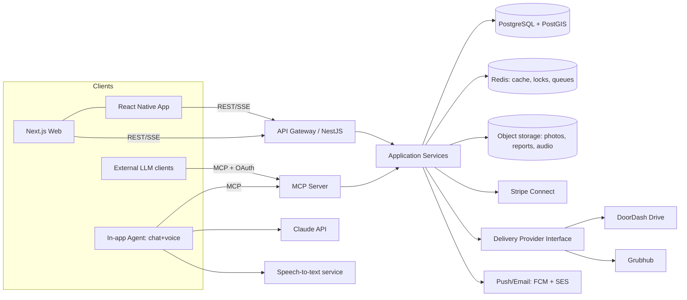

# Architecture Document: Nanas' Kitchens

## Overview & Diagram
A modular monolith API (NestJS) backed by PostgreSQL/PostGIS, fronted by a Next.js web
app and React Native mobile app. A first-party **MCP server** is a thin adapter over the
same application services the REST API uses (NFR3) — the in-app agent and external LLM
clients both transact through it. Delivery is abstracted behind a provider interface
with DoorDash Drive and Grubhub implementations. Stripe Connect handles payments/payouts.



## Tech Stack
| Layer | Choice | Version | Why |
|---|---|---|---|
| Backend | NestJS (Node 22, TypeScript 5) | 11.x | Modular monolith, DI, testability |
| DB | PostgreSQL + PostGIS | 16 / 3.4 | Relational integrity + native geo radius (NFR2) |
| Cache/locks/queue | Redis + BullMQ | 7.x | Idempotency, webhooks, notifications |
| Web | Next.js | 15 | SSR for SEO on kitchen pages |
| Mobile | React Native (Expo) | SDK 53 | One codebase, push support |
| Agent LLM | Claude API (tool use) | messages v1 | Conversational ordering, FR12/FR15 |
| MCP | @modelcontextprotocol/sdk (TS) | 1.x | First-party tool surface, FR14 |
| STT | OpenAI Whisper API (or Deepgram) | — | Fast multilingual voice (NFR4, NFR9) |
| Payments | Stripe Connect (Express) | 2025 API | PCI delegation (NFR6), payouts FR21 |
| Delivery | DoorDash Drive API; Grubhub API | current | FR9 via provider interface |
| Storage | S3-compatible | — | Photos, health reports, voice clips |
| Notifications | FCM + SES | — | FR22 |
| Infra | Docker, GitHub Actions, Terraform | — | Reproducible envs, CI from Epic 1 |

## Data Model (key entities)
- **User**(id, role[buyer|seller|inspector|admin], email, phone, locale)
- **Kitchen**(id, sellerId, name, cuisineTag, description, photos[], address_encrypted,
  geo POINT(geography), complianceAttestedAt, hygieneScoreId?, ratingAvg, ratingCount)
- **Dish**(id, kitchenId, name, description, photo, priceCents, dietaryTags[])
- **MenuDay**(id, kitchenId, date, status[draft|published], readyWindows[] of
  {start,end,slotMinutes})
- **MenuItem**(id, menuDayId, dishId, portionsTotal, portionsRemaining) ← inventory row
- **Order**(id, buyerId, kitchenId, menuDayId, status[pending|confirmed|accepted|
  declined|preparing|ready|completed|cancelled], readySlot, fulfillment[pickup|delivery],
  totalCents, commissionCents, paymentIntentId, idempotencyKey)
- **OrderItem**(orderId, menuItemId, qty, unitPriceCents)
- **DeliveryJob**(id, orderId, provider[doordash|grubhub], externalId, status,
  trackingUrl, feeCents)
- **Review**(id, orderId UNIQUE, kitchenId, buyerId, rating, text) — FR16 gate via
  orderId FK on completed orders
- **Poll**(id, kitchenId, question, options[], closesAt) / **PollVote**(pollId, buyerId
  UNIQUE per poll)
- **DishRequest**(id, kitchenId, buyerId, text, status[open|accepted|declined])
- **HealthReport**(id, kitchenId, fileUrl, uploadedAt)
- **InspectionVisit**(id, kitchenId, inspectorId, scheduledAt, status) /
  **HygieneScore**(id, visitId, total 0–100, subScores jsonb, photos[], submittedAt)
- **AuditLog**(id, actor, entity, action, before, after, at) — NFR10

## API / Tool Surface
REST (per resource, OpenAPI-documented): `/kitchens`, `/kitchens/search?lat&lng&radius=10mi
&cuisine=`, `/menus`, `/orders`, `/orders/:id/status`, `/reviews`, `/polls`,
`/dish-requests`, `/health-reports`, `/inspections`, `/webhooks/{stripe,doordash,grubhub}`.
SSE: `/kitchens/:id/portions/stream` for live counts.

**MCP tools (FR14)** — each delegates to the same application service as REST:
| Tool | Maps to |
|---|---|
| `search_kitchens(lat,lng,cuisine?)` | KitchenService.search |
| `get_menu(kitchenId,date?)` | MenuService.getPublished |
| `check_portions(menuItemIds[])` | InventoryService.remaining |
| `create_order(draft, confirm=true)` | OrderService.place (requires confirmed=true flag set only after agent shows summary — FR15) |
| `get_order_status(orderId)` | OrderService.status |
| `cancel_order(orderId)` | OrderService.cancel |
External clients authenticate via OAuth 2.1 device/PKCE flow scoped to the buyer.

## Key Workflows
1. **Atomic order placement (FR8/NFR1):** single SQL transaction:
   `UPDATE menu_items SET portions_remaining = portions_remaining - :qty WHERE id=:id
   AND portions_remaining >= :qty` → if rowcount 0, abort with PORTIONS_CONFLICT; then
   create Order + Stripe PaymentIntent (idempotency key = order draft id); on payment
   failure, compensating restore. Cancellation/decline restores portions in-transaction.
2. **Conversational order (FR12–FR15):** client streams chat → agent service calls
   Claude with MCP tools; agent must render summary and obtain explicit confirmation;
   only then is `create_order(confirm=true)` permitted (server rejects unconfirmed).
   Voice: audio clip → STT → same loop (target < 5 s to first token, NFR4).
3. **Delivery (FR9/NFR8):** at checkout, quote via provider interface (timeout 3 s →
   offer pickup fallback); on order Ready, create delivery job; provider webhooks update
   DeliveryJob status → notifications.
4. **Inspection (FR20):** admin assigns visit → inspector portal form (offline draft in
   IndexedDB) → submit-once HygieneScore → badge denormalized onto Kitchen.

## NFR Coverage
| NFR | Decision |
|---|---|
| NFR1 | Conditional-update inventory transaction; race tests in CI |
| NFR2 | PostGIS GIST index on Kitchen.geo; radius query + cuisine btree |
| NFR3 | MCP server and REST controllers are thin adapters over shared services |
| NFR4 | Streaming STT + streamed agent tokens; audio clips capped 60 s |
| NFR5 | pgcrypto column encryption for addresses; address exposure rules in service layer |
| NFR6 | Stripe Elements/PaymentSheet; no PAN on servers |
| NFR7 | Next.js a11y lint, axe CI checks; agent channel as alternative modality |
| NFR8 | BullMQ retries, idempotency keys, circuit breaker per provider, pickup fallback |
| NFR9 | i18next; ICU messages; RTL stylesheets |
| NFR10 | AuditLog interceptor on mutating service methods |

## Security, Privacy & Compliance
JWT + refresh sessions; role guards per portal; OAuth 2.1 for external MCP clients;
signed URLs for documents; webhook signature verification (Stripe/DoorDash/Grubhub);
rate limiting on MCP tools; cottage-food attestation stored with timestamp + IP.

## Risks & Mitigations
- **Partner API access delays** → build against sandbox + mock provider implementation
  behind the same interface; pickup-only launch mode flag.
- **Oversell under load** → mitigation in Workflow 1; k6 race test gate in CI.
- **Agent over-ordering / hallucinated items** → server-side validation that every
  order item id exists in the quoted menu snapshot; FR15 confirm flag enforced server-side.

## Source Tree (proposed)
```
culture-eats/
├── apps/
│   ├── api/            # NestJS modules: auth, kitchens, menus, inventory, orders,
│   │                   # delivery, payments, community, trust, notifications, audit
│   ├── mcp-server/     # MCP adapter over api services (same monorepo package imports)
│   ├── agent/          # chat/voice orchestration (Claude + STT)
│   ├── web/            # Next.js buyer + seller + inspector portals
│   └── mobile/         # Expo app
├── packages/
│   ├── core/           # domain services, entities, shared types
│   └── providers/      # delivery/{doordash,grubhub,mock}, stt, payments
├── infra/              # terraform, docker
└── docs/               # BMAD artifacts
```

## Handoff to Scrum Master
Stories must embed: relevant entity definitions, the exact endpoint/tool signatures
they implement, and target file paths from the source tree. Inventory and order stories
must include race-condition test requirements (NFR1).
