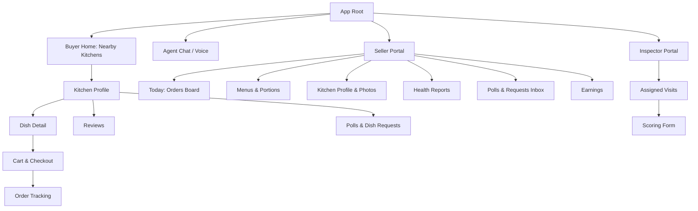

# UI/UX Specification: Nanas' Kitchens

## UX Goals & Principles
1. **Two doors, one kitchen** — the chat/voice agent and the classic UI are peers; any
   order is fully achievable in either (FR12 parity with FR5–FR8).
2. **Designed for the least technical seller** — large targets, single-screen daily
   workflow, photo-first input, no jargon.
3. **Trust visible at a glance** — hygiene badge, report recency, rating, and distance
   appear together on every kitchen card.
4. **Scarcity honest, never dark** — remaining portions are factual counts, updated
   live, never artificially inflated urgency.

## Personas (UI implications)
- **Ayşe, seller (Turkish kitchen, 52)** — manages everything from a phone; needs a
  "today" screen: publish menu, see orders by ready-time, tap to advance status.
- **Wei, buyer (28, diaspora)** — searches by cuisine, often re-orders; chat is fastest.
- **Maria, buyer (64)** — prefers voice; large text mode; accessibility critical (NFR7).
- **Inspector Dan** — tablet form in the field; offline-tolerant draft saving.

## Information Architecture

Navigation: bottom tabs for buyers (Home, Chat, Orders, Profile); seller portal is a
separate role-switched shell.

## Key Screens

### Buyer Home — Nearby Kitchens
- Purpose / FRs: FR5; entry to everything.
- Elements: location chip ("within 10 mi"), cuisine filter pills (with cultural flags/
  icons + text labels), kitchen cards (photo, cuisine, rating, hygiene badge, distance,
  "X portions left today").
- States: empty ("No kitchens in your area yet — ask the agent to notify you"),
  loading skeleton cards, location-permission error with manual zip fallback.

### Kitchen Profile
- FRs: FR1, FR6, FR16, FR17, FR18, FR19, FR20.
- Elements: photo gallery, hygiene score badge + last-inspection date, health-report
  documents list, today's menu with live portion counts, ready-time windows, reviews
  tab, active poll card, "Request a dish" button.
- States: menu-not-published-today state; sold-out dishes shown greyed with count 0.

### Cart & Checkout
- FRs: FR7, FR8, FR10, FR21.
- Elements: ready-time slot picker (only slots with capacity), fulfillment toggle
  (Pickup / Delivery with partner fee quote), Stripe payment sheet.
- States: portion-changed conflict dialog ("Only 2 left — update quantity?"), payment
  failure retry, delivery-quote unavailable → suggest pickup (NFR8 degradation).

### Agent Chat (+ voice)
- FRs: FR12–FR15.
- Elements: text input + hold-to-talk mic; agent renders structured order-summary card
  requiring an explicit "Confirm order" tap or spoken "yes" before purchase (FR15);
  inline kitchen/dish chips deep-link to UI screens for users who want to peek.
- States: transcription-in-progress, low-confidence transcription ("Did you mean…"),
  tool-failure apology with UI fallback link.

### Seller Today Board
- FRs: FR11, FR22.
- Elements: columns by status (New → Accepted → Preparing → Ready → Done), each order
  card shows ready-time, items, fulfillment mode; accept/decline countdown timer.
- States: empty day, declined-order confirmation, delivery-partner status chips.

### Menus & Portions (Seller)
- FRs: FR3, FR4, FR6.
- Elements: dish library, "publish today's menu" wizard (pick dishes → set portions →
  set ready windows → publish), live remaining counters with +/- correction.
- States: unpublished draft, editing-after-orders warning.

### Inspector Scoring Form
- FRs: FR20. Structured sub-scores (storage, prep surfaces, temperature control,
  personal hygiene, documentation), photo evidence, offline draft, submit-once lock.

## Brand & Visual Identity (from approved brand board)
- **Logo**: cooking pot with heart + leaf sprouts; wordmark "Nanas' Kitchens"
  (canonical name is plural — the brand-board draft showed singular; use plural
  everywhere, logo asset to be regenerated accordingly).
- **Tagline**: "Real Food. Made by Neighbors." — secondary: "Local kitchens. Real
  recipes. Made with love. Just for you."
- **Palette**: primary orange (#E8720C vibes — CTAs, brand accents), deep green
  (#2E4A2E — headings, trust badges like "Support Local · Stronger Together"),
  warm cream background (#FAF3E4), soft food-photography imagery.
- **Feature pillars** (marketing + empty states): Find Local Cooks · Homemade Meals ·
  AI Chat & Easy Order · Pickup or Delivery · Personalized Menus.
- **Mobile home reference**: greeting ("Hungry for something delicious?"), search bar
  (meals/cuisines/cooks), "Made with ♥ near you — within 10 miles" location card,
  horizontal "Top Picks Near You" dish cards (photo, dish, kitchen, rating, distance),
  AI Chat Assistant entry card, bottom tabs Home · Orders · (+) · Chat · Profile.

## Platform Split
- **Web (Next.js)**: buyer flows with SSR/SEO on kitchen pages; seller and inspector
  portals.
- **Mobile (Kotlin Multiplatform + Compose Multiplatform)**: single shared Kotlin
  codebase for iOS and Android — shared Compose UI, domain models, and Ktor REST/SSE
  client hitting the same Spring Boot API (NFR3: no mobile-only endpoints).

## Cross-cutting
- **Accessibility**: WCAG 2.1 AA; all flows completable via the conversational channel
  as an alternative modality (NFR7); badges use text + color; dynamic type support.
- **Localization**: i18n from day one; RTL-ready layouts (NFR9); cuisine names shown in
  English + native script where provided.
- **Responsive**: mobile-first; seller and inspector portals also comfortable on tablet.

## Handoff to Architect
Live portion counts on Home/Profile/Cart imply a cheap real-time channel (SSE or
websocket) or short-poll API. Agent chat needs streaming responses. Voice requires
upload of short audio clips and fast STT (NFR4). Checkout depends on synchronous
delivery-fee quotes from partners with a timeout fallback to pickup.
